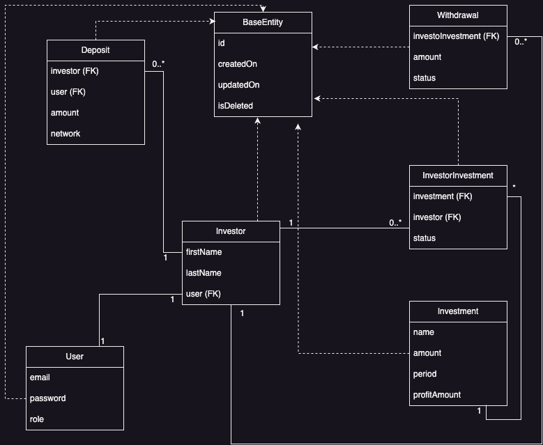

# Caniverse Investment Platform

The Caniverse Investment Platform is a web application designed to manage investments, deposits, and withdrawals efficiently. 
Built with Spring Boot and JTE, it provides a robust and scalable solution for investment management.

## Technologies Used

- **Backend**: Spring Boot, Spring Data JPA (Hibernate), Spring Security
- **Frontend**: JTE (Java Template Engine)
- **Database**: MySQL
- **Build Tool**: Maven
- **Java Version**: 21

## Features
- User authentication and authorization using Spring Security
- Investment management with CRUD operations
- Deposit and withdrawal transactions
- Responsive and dynamic templates using JTE
- Database integration with Spring Data JPA and MySQL

## ERD


## Installation and Setup

1. **Clone the repository**:
   ```bash
   git clone https://github.com/graccasoft/caniverse-investment.git
   ```
2. **Navigate to the project directory**:
   ```bash
   cd caniverse-investment
   ```
3. **Set up MySQL database**:
    - Create a mysql database.
    - Set these environment variables:
      - `SPRING_JDBC_URL`
      - `SPRING_JDBC_PASSWORD`
      - `SPRING_JDBC_USER`
4. **Build the project**:
   ```bash
   mvn clean install
   ```
5. **Run the application**:
   ```bash
   mvn spring-boot:run
   ```
6. **Access the application**:
    - Open your browser and go to `http://localhost:8080`.

## Usage

- **Home Page**: Displays a welcome message and navigation links.
- **Login/Register**: Users can log in or register to access the platform.
- **Dashboard**: Authenticated users can view and manage their investments.
- **Transactions**: Users can perform deposit and withdrawal transactions.

## Screenshots

## Contact

- **Name**: Gracious
- **Email**: gracious.mashasha@gmail.com
- **LinkedIn**: [My LinkedIn Profile](https://www.linkedin.com/in/gracious-mashasha-4bbb2713/)
- **Hire Me**: [My Upwork Profile](https://www.linkedin.com/in/gracious-mashasha-4bbb2713/)